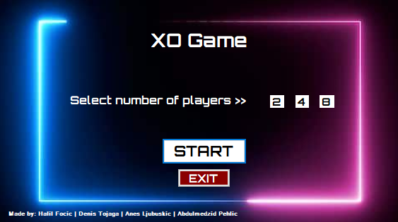

# XO-Game---Project

XO Championship made with cSharp programming language, it has 4 forms that have certain functionality.

### Main form
Main form lets you pick how many players can attent the tournament ( 2 4 8 selection ), when you hit start it opens up a new form.
  

  

### Tournament sheet
Second one lets you to write in the names of the number of players that you picked previously,it lets you name 8 players
if you picked to have quarter finals, 4 for semi finals, and in the end two best players play.
  

### Game 
After that when you hit start game,it opens the new form which is actually holding a game board and result section.
In that board you have button next round which restarts the board and lets you play again until you reach 2 victories, which lead you in the next part of championship.
  

### Winner
When the game ends it will open up the tournament result so you can see current winner,when the last two players play it will open the last 
form which says Congratulations to the winner.
  

